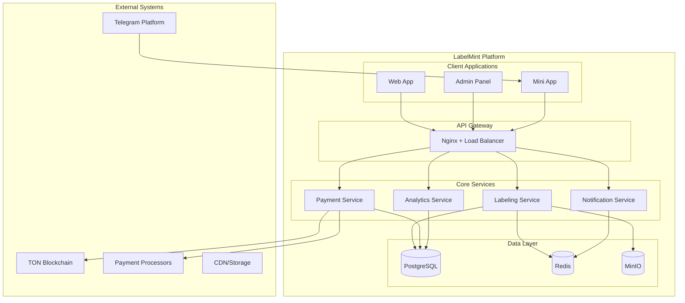
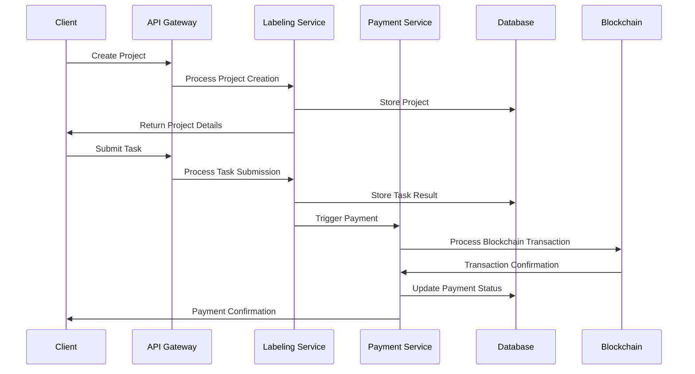
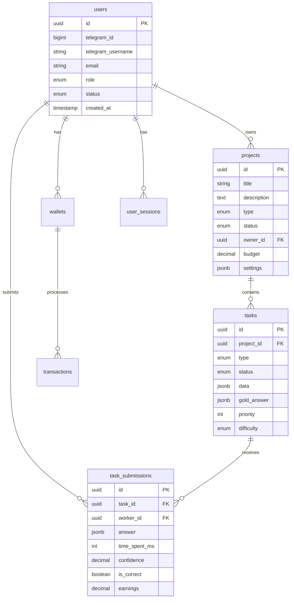
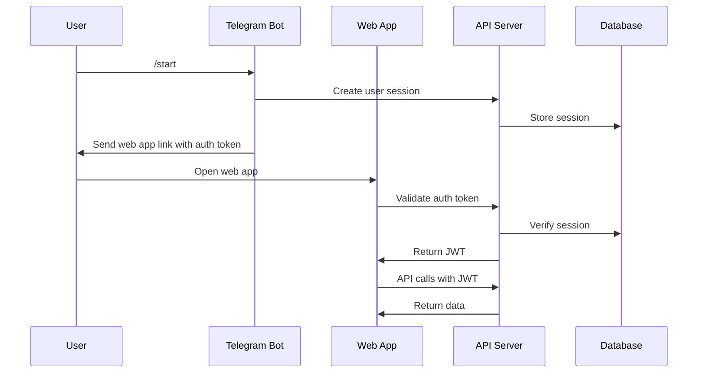

# 🏗️ LabelMint Architecture

Comprehensive system architecture documentation for the LabelMint platform, covering design decisions, component interactions, and technical specifications.

## Table of Contents

1. [Architecture Overview](#architecture-overview)
2. [System Design Principles](#system-design-principles)
3. [High-Level Architecture](#high-level-architecture)
4. [Component Architecture](#component-architecture)
5. [Data Architecture](#data-architecture)
6. [Application Architecture](#application-architecture)
7. [Infrastructure Architecture](#infrastructure-architecture)
8. [Security Architecture](#security-architecture)
9. [Blockchain Integration](#blockchain-integration)
10. [API Architecture](#api-architecture)
11. [Frontend Architecture](#frontend-architecture)
12. [Scalability Architecture](#scalability-architecture)
13. [Performance Architecture](#performance-architecture)
14. [Monitoring & Observability](#monitoring--observability)
15. [Technology Stack](#technology-stack)
16. [Design Decisions](#design-decisions)
17. [Future Architecture](#future-architecture)

## Architecture Overview

LabelMint is a comprehensive data labeling platform built on a microservices architecture with blockchain-based payment integration. The system is designed for scalability, reliability, and security while providing an excellent user experience for both clients and workers.

### Core Components

```
┌─────────────────────────────────────────────────────────────────┐
│                        Client Layer                              │
│  ┌─────────────┐  ┌─────────────┐  ┌─────────────────────────┐  │
│  │ Web Client  │  │ Admin Panel │  │   Telegram Mini App     │  │
│  │  (Next.js)  │  │ (Next.js)   │  │     (Vite + React)      │  │
│  └─────────────┘  └─────────────┘  └─────────────────────────┘  │
└─────────────────────┬───────────────────────────────────────────┘
                      │
┌─────────────────────▼───────────────────────────────────────────┐
│                      API Gateway                                │
│                   (Nginx + Load Balancer)                      │
└─────────────────────┬───────────────────────────────────────────┘
                      │
┌─────────────────────▼───────────────────────────────────────────┐
│                    Service Layer                                │
│  ┌─────────────┐  ┌─────────────┐  ┌─────────────────────────┐  │
│  │Labeling API │  │Payment API  │  │    Telegram Bots        │  │
│  │ (Express)   │  │ (Express)   │  │     (Grammy)            │  │
│  └─────────────┘  └─────────────┘  └─────────────────────────┘  │
└─────────────────────┬───────────────────────────────────────────┘
                      │
┌─────────────────────▼───────────────────────────────────────────┐
│                    Data Layer                                   │
│  ┌─────────────┐  ┌─────────────┐  ┌─────────────────────────┐  │
│  │ PostgreSQL  │  │    Redis    │  │     MinIO (S3)          │  │
│  │ (Primary)   │  │ (Cache)     │  │   (File Storage)        │  │
│  └─────────────┘  └─────────────┘  └─────────────────────────┘  │
└─────────────────────┬───────────────────────────────────────────┘
                      │
┌─────────────────────▼───────────────────────────────────────────┐
│                Blockchain Layer                                │
│  ┌─────────────┐  ┌─────────────┐  ┌─────────────────────────┐  │
│  │ TON Network │  │   USDT      │  │   Smart Contracts       │  │
│  │ (Payments)  │  │ (Stablecoin)│  │   (Payment Logic)       │  │
│  └─────────────┘  └─────────────┘  └─────────────────────────┘  │
└─────────────────────────────────────────────────────────────────┘
```

## System Design Principles

### 1. Microservices Architecture

**Rationale**: Enables independent development, deployment, and scaling of different components.

**Benefits**:
- **Isolation**: Failure in one service doesn't affect others
- **Scalability**: Scale individual components based on demand
- **Technology Diversity**: Use best technology for each service
- **Team Autonomy**: Teams can work independently

**Trade-offs**:
- **Complexity**: More moving parts to manage
- **Network Latency**: Inter-service communication overhead
- **Data Consistency**: Requires distributed data management

### 2. Event-Driven Architecture

**Rationale**: Loose coupling between services and real-time responsiveness.

**Implementation**:
```typescript
// Event publishing example
interface TaskEvent {
  type: 'TASK_CREATED' | 'TASK_ASSIGNED' | 'TASK_COMPLETED';
  payload: TaskData;
  timestamp: Date;
  userId: string;
}

// Event handling
eventBus.subscribe('TASK_COMPLETED', async (event) => {
  await paymentService.processPayment(event.payload);
  await notificationService.notifyWorker(event.payload);
  await analyticsService.recordCompletion(event.payload);
});
```

### 3. Domain-Driven Design (DDD)

**Rationale**: Align software architecture with business domains.

**Bounded Contexts**:
- **Project Management**: Project creation, configuration, management
- **Task Management**: Task assignment, completion, quality control
- **Payment Processing**: Blockchain transactions, wallet management
- **User Management**: Authentication, authorization, profiles
- **Analytics**: Reporting, metrics, insights

### 4. API-First Design

**Rationale**: Clear contracts between frontend and backend services.

**Implementation**:
```typescript
// OpenAPI specification
openapi: 3.0.0
info:
  title: LabelMint API
  version: 1.0.0
paths:
  /api/projects:
    post:
      summary: Create a new project
      requestBody:
        required: true
        content:
          application/json:
            schema:
              $ref: '#/components/schemas/CreateProjectRequest'
      responses:
        201:
          description: Project created successfully
          content:
            application/json:
              schema:
                $ref: '#/components/schemas/Project'
```

## High-Level Architecture

### System Boundaries



### Data Flow Architecture



## Component Architecture

### 1. Labeling Service

**Purpose**: Core business logic for task management and quality control.

**Key Components**:
```typescript
// Task Assignment Service
class TaskAssignmentService {
  async assignTask(workerId: string, preferences: TaskPreferences): Promise<Task> {
    // Find eligible tasks based on worker skills and performance
    // Implement priority scoring algorithm
    // Reserve task for worker (30-minute window)
  }
}

// Consensus Engine
class ConsensusEngine {
  async calculateConsensus(taskId: string, answers: TaskAnswer[]): Promise<ConsensusResult> {
    // Implement weighted voting algorithm
    // Handle quality scoring and worker reliability
    // Determine final consensus or request more judgments
  }
}

// Quality Control Service
class QualityControlService {
  async validateSubmission(submission: TaskSubmission): Promise<ValidationResult> {
    // Run automated validation checks
    // Cross-reference with known answers (gold tasks)
    // Update worker performance metrics
  }
}
```

### 2. Payment Service

**Purpose**: Handle blockchain payments and wallet management.

**Architecture**:
```typescript
// Payment Processor
class PaymentProcessor {
  async processPayment(taskId: string, workerId: string): Promise<PaymentResult> {
    // Calculate payment amount based on task complexity
    // Verify worker eligibility and wallet address
    // Execute blockchain transaction
    // Handle retry logic and error recovery
  }
}

// Wallet Manager
class WalletManager {
  async createWallet(userId: string): Promise<WalletAddress> {
    // Generate secure wallet address
    // Encrypt and store private keys
    // Set up multi-sig if required
  }
}

// Transaction Monitor
class TransactionMonitor {
  async monitorTransaction(txHash: string): Promise<TransactionStatus> {
    // Poll blockchain for transaction confirmation
    // Handle timeout and retry scenarios
    // Update payment status in database
  }
}
```

### 3. Telegram Integration

**Purpose**: Native Telegram experience for users.

**Components**:
```typescript
// Client Bot
class ClientBot {
  async handleStartCommand(ctx: Context): Promise<void> {
    // Register new client
    // Send welcome message and web app link
    // Set up user preferences
  }
}

// Worker Bot
class WorkerBot {
  async handleTaskRequest(ctx: Context): Promise<void> {
    // Get next available task
    // Send task interface via web app
    // Handle task completion notifications
  }
}

// Web App Integration
class WebAppIntegration {
  generateAuthData(userId: string): WebAppAuthData {
    // Create secure authentication token
    // Include timestamp and expiration
    // Sign with bot secret
  }
}
```

## Data Architecture

### Database Schema

**Core Entities**:
```sql
-- Users and Authentication
CREATE TABLE users (
    id UUID PRIMARY KEY DEFAULT gen_random_uuid(),
    telegram_id BIGINT UNIQUE NOT NULL,
    telegram_username VARCHAR(255),
    email VARCHAR(255),
    role user_role NOT NULL,
    status user_status DEFAULT 'ACTIVE',
    created_at TIMESTAMP DEFAULT NOW(),
    updated_at TIMESTAMP DEFAULT NOW()
);

-- Projects
CREATE TABLE projects (
    id UUID PRIMARY KEY DEFAULT gen_random_uuid(),
    title VARCHAR(255) NOT NULL,
    description TEXT,
    type task_type NOT NULL,
    status project_status DEFAULT 'DRAFT',
    owner_id UUID REFERENCES users(id),
    budget DECIMAL(10,2),
    settings JSONB,
    created_at TIMESTAMP DEFAULT NOW(),
    updated_at TIMESTAMP DEFAULT NOW()
);

-- Tasks
CREATE TABLE tasks (
    id UUID PRIMARY KEY DEFAULT gen_random_uuid(),
    project_id UUID REFERENCES projects(id),
    type task_type NOT NULL,
    status task_status DEFAULT 'PENDING',
    data JSONB NOT NULL,
    gold_answer JSONB,
    priority INTEGER DEFAULT 0,
    difficulty task_difficulty DEFAULT 'MEDIUM',
    created_at TIMESTAMP DEFAULT NOW(),
    updated_at TIMESTAMP DEFAULT NOW()
);

-- Task Submissions
CREATE TABLE task_submissions (
    id UUID PRIMARY KEY DEFAULT gen_random_uuid(),
    task_id UUID REFERENCES tasks(id),
    worker_id UUID REFERENCES users(id),
    answer JSONB NOT NULL,
    time_spent_ms INTEGER,
    confidence DECIMAL(3,2),
    is_correct BOOLEAN,
    earnings DECIMAL(10,4) DEFAULT 0,
    created_at TIMESTAMP DEFAULT NOW()
);

-- Wallets
CREATE TABLE wallets (
    id UUID PRIMARY KEY DEFAULT gen_random_uuid(),
    user_id UUID REFERENCES users(id),
    address VARCHAR(255) NOT NULL,
    currency wallet_currency NOT NULL,
    balance DECIMAL(15,4) DEFAULT 0,
    created_at TIMESTAMP DEFAULT NOW(),
    updated_at TIMESTAMP DEFAULT NOW()
);

-- Transactions
CREATE TABLE transactions (
    id UUID PRIMARY KEY DEFAULT gen_random_uuid(),
    wallet_id UUID REFERENCES wallets(id),
    type transaction_type NOT NULL,
    amount DECIMAL(15,4) NOT NULL,
    currency wallet_currency NOT NULL,
    status transaction_status DEFAULT 'PENDING',
    blockchain_hash VARCHAR(255),
    metadata JSONB,
    created_at TIMESTAMP DEFAULT NOW(),
    updated_at TIMESTAMP DEFAULT NOW()
);
```

### Data Relationships



### Caching Strategy

**Redis Data Structure**:
```typescript
// Cache configuration
interface CacheConfig {
  userSession: {
    prefix: 'session:';
    ttl: 24 * 60 * 60; // 24 hours
    structure: 'hash';
  };
  taskQueue: {
    prefix: 'tasks:';
    ttl: 30 * 60; // 30 minutes
    structure: 'list';
  };
  userPerformance: {
    prefix: 'perf:';
    ttl: 60 * 60; // 1 hour
    structure: 'hash';
  };
  rateLimit: {
    prefix: 'rate:';
    ttl: 15 * 60; // 15 minutes
    structure: 'string';
  };
}

// Cache implementation
class CacheService {
  async getUserSession(userId: string): Promise<UserSession | null> {
    const key = `session:${userId}`;
    return await redis.hgetall(key);
  }

  async getAvailableTasks(workerId: string): Promise<Task[]> {
    const queueKey = `tasks:${workerType(workerId)}`;
    const taskIds = await redis.lrange(queueKey, 0, 9);
    return Promise.all(taskIds.map(id => this.getTaskById(id)));
  }

  async updateUserPerformance(userId: string, metrics: PerformanceMetrics): Promise<void> {
    const key = `perf:${userId}`;
    await redis.hmset(key, metrics);
    await redis.expire(key, 3600); // 1 hour
  }
}
```

## Application Architecture

### Service Communication

**Synchronous Communication**:
```typescript
// REST API calls
class APIClient {
  async createProject(project: CreateProjectRequest): Promise<Project> {
    const response = await fetch('/api/projects', {
      method: 'POST',
      headers: { 'Content-Type': 'application/json' },
      body: JSON.stringify(project)
    });
    return response.json();
  }
}

// gRPC for internal service communication
interface TaskService {
  AssignTask(request: AssignTaskRequest): Promise<TaskResponse>;
  SubmitAnswer(request: SubmitAnswerRequest): Promise<SubmissionResponse>;
}
```

**Asynchronous Communication**:
```typescript
// Event-driven architecture
interface Event {
  id: string;
  type: string;
  payload: any;
  timestamp: Date;
  userId: string;
}

class EventBus {
  async publish(event: Event): Promise<void> {
    await redis.publish('events', JSON.stringify(event));
  }

  async subscribe(pattern: string, handler: (event: Event) => void): Promise<void> {
    const subscriber = redis.duplicate();
    await subscriber.subscribe(pattern);
    subscriber.on('message', (channel, message) => {
      handler(JSON.parse(message));
    });
  }
}
```

### Service Mesh

**Istio Configuration**:
```yaml
# istio-config.yaml
apiVersion: networking.istio.io/v1beta1
kind: VirtualService
metadata:
  name: labeling-service
spec:
  hosts:
  - labeling-service
  http:
  - match:
    - uri:
        prefix: "/api"
    route:
    - destination:
        host: labeling-service
        port:
          number: 3001
    timeout: 30s
    retries:
      attempts: 3
      perTryTimeout: 10s
---
apiVersion: networking.istio.io/v1beta1
kind: DestinationRule
metadata:
  name: labeling-service
spec:
  host: labeling-service
  trafficPolicy:
    connectionPool:
      tcp:
        maxConnections: 100
    loadBalancer:
      simple: LEAST_CONN
    circuitBreaker:
      consecutiveErrors: 3
      interval: 30s
      baseEjectionTime: 30s
```

## Infrastructure Architecture

### Container Orchestration

**Kubernetes Deployment**:
```yaml
# deployment.yaml
apiVersion: apps/v1
kind: Deployment
metadata:
  name: labeling-service
spec:
  replicas: 3
  strategy:
    type: RollingUpdate
    rollingUpdate:
      maxSurge: 1
      maxUnavailable: 0
  selector:
    matchLabels:
      app: labeling-service
  template:
    metadata:
      labels:
        app: labeling-service
        version: v1
    spec:
      containers:
      - name: labeling-service
        image: labelmint/labeling-service:v1.2.0
        ports:
        - containerPort: 3001
        env:
        - name: DATABASE_URL
          valueFrom:
            secretKeyRef:
              name: labelmint-secrets
              key: database-url
        resources:
          requests:
            cpu: 250m
            memory: 512Mi
          limits:
            cpu: 1000m
            memory: 2Gi
        livenessProbe:
          httpGet:
            path: /health
            port: 3001
          initialDelaySeconds: 30
          periodSeconds: 10
        readinessProbe:
          httpGet:
            path: /ready
            port: 3001
          initialDelaySeconds: 5
          periodSeconds: 5
```

### Service Discovery

**Consul Configuration**:
```typescript
// Service registration
class ServiceRegistry {
  async registerService(service: ServiceInfo): Promise<void> {
    await consul.agent.service.register({
      name: service.name,
      id: service.id,
      address: service.address,
      port: service.port,
      tags: service.tags,
      check: {
        http: `http://${service.address}:${service.port}/health`,
        interval: '10s',
        timeout: '5s'
      }
    });
  }

  async discoverService(serviceName: string): Promise<ServiceInfo[]> {
    const services = await consul.health.service({
      service: serviceName,
      passing: true
    });
    return services.map(service => ({
      id: service.Service.ID,
      name: service.Service.Service,
      address: service.Service.Address,
      port: service.Service.Port
    }));
  }
}
```

## Security Architecture

### Authentication Flow



### Authorization Model

**RBAC Implementation**:
```typescript
interface Permission {
  resource: string;
  action: string;
  conditions?: Record<string, any>;
}

interface Role {
  name: string;
  permissions: Permission[];
}

class AuthorizationService {
  async can(userId: string, action: string, resource: string): Promise<boolean> {
    const user = await this.getUser(userId);
    const role = await this.getRole(user.role);

    return role.permissions.some(permission =>
      permission.resource === resource &&
      permission.action === action &&
      this.evaluateConditions(permission.conditions, user, resource)
    );
  }

  private evaluateConditions(conditions: any, user: User, resource: any): boolean {
    // Implement condition evaluation logic
    // E.g., user can only access their own projects
    return true;
  }
}
```

## Blockchain Integration

### TON Payment Architecture

```typescript
// TON Service Architecture
class TONPaymentService {
  private tonClient: TonClient;
  private walletContract: WalletContract;

  async createPayment(amount: number, recipient: string): Promise<string> {
    // Create payment transaction
    const transaction = await this.walletContract.createTransfer({
      to: Address.parse(recipient),
      value: toNano(amount),
      bounce: false
    });

    // Sign and send transaction
    const signedTransaction = await this.walletClient.send(transaction);

    return signedTransaction.hash;
  }

  async verifyPayment(txHash: string): Promise<PaymentStatus> {
    const transaction = await this.tonClient.getTransaction(txHash);

    return {
      status: this.getTransactionStatus(transaction),
      amount: transaction.outMsgs[0].value,
      recipient: transaction.outMsgs[0].destination,
      confirmed: transaction.blockId !== null
    };
  }
}
```

### Smart Contract Design

**Solidity Contract**:
```solidity
// PaymentProcessor.sol
contract PaymentProcessor {
    mapping(address => uint256) public balances;
    mapping(address => bool) public authorizedUsers;

    event PaymentProcessed(address indexed from, address indexed to, uint256 amount);
    event Withdrawal(address indexed to, uint256 amount);

    modifier onlyAuthorized() {
        require(authorizedUsers[msg.sender], "Unauthorized: caller not authorized");
        _;
    }

    modifier validAddress(address addr) {
        require(addr != address(0), "Invalid address");
        _;
    }

    function deposit() external payable {
        require(msg.value > 0, "Deposit amount must be greater than 0");
        balances[msg.sender] += msg.value;
        emit PaymentProcessed(msg.sender, address(this), msg.value);
    }

    function withdraw(address payable to, uint256 amount)
        external
        onlyAuthorized
        validAddress(to)
    {
        require(balances[to] >= amount, "Insufficient balance");
        balances[to] -= amount;

        (bool success, ) = to.call{value: amount}("");
        require(success, "Transfer failed");

        emit Withdrawal(to, amount);
    }

    function getBalance(address user) external view returns (uint256) {
        return balances[user];
    }
}
```

## API Architecture

### RESTful API Design

**API Structure**:
```
/api/v1/
├── auth/
│   ├── POST /login
│   ├── POST /logout
│   ├── POST /refresh
│   └── GET /profile
├── projects/
│   ├── GET /projects
│   ├── POST /projects
│   ├── GET /projects/:id
│   ├── PUT /projects/:id
│   ├── DELETE /projects/:id
│   ├── POST /projects/:id/start
│   └── POST /projects/:id/pause
├── tasks/
│   ├── GET /tasks/next
│   ├── POST /tasks/:id/submit
│   ├── POST /tasks/:id/skip
│   └── GET /tasks/:id/history
├── payments/
│   ├── GET /payments/balance
│   ├── POST /payments/withdraw
│   ├── GET /payments/history
│   └── GET /payments/transactions/:id
├── analytics/
│   ├── GET /analytics/dashboard
│   ├── GET /analytics/projects/:id
│   └── GET /analytics/workers/:id
└── admin/
    ├── GET /admin/users
    ├── GET /admin/projects
    └── POST /admin/approve-project
```

### GraphQL API (Alternative)

**Schema Definition**:
```graphql
type Query {
  projects(filter: ProjectFilter): [Project!]!
  project(id: ID!): Project
  tasks(filter: TaskFilter): [Task!]!
  user(id: ID!): User
  analytics: Analytics!
}

type Mutation {
  createProject(input: CreateProjectInput!): Project!
  updateProject(id: ID!, input: UpdateProjectInput!): Project!
  submitTaskAnswer(taskId: ID!, answer: TaskAnswerInput!): TaskSubmission!
  requestWithdrawal(amount: Float!): WithdrawalRequest!
}

type Subscription {
  taskAssigned(workerId: ID!): Task!
  projectUpdated(projectId: ID!): Project!
  paymentCompleted(userId: ID!): Payment!
}
```

## Frontend Architecture

### Web Application (Next.js)

**Component Architecture**:
```typescript
// Page structure
app/
├── (auth)/
│   ├── login/
│   └── register/
├── (dashboard)/
│   ├── projects/
│   │   ├── page.tsx
│   │   ├── create/
│   │   └── [id]/
│   ├── analytics/
│   └── settings/
├── api/
│   └── auth/
└── globals.css

// Component hierarchy
<Layout>
  <Header />
  <Sidebar />
  <MainContent>
    <Routes>
      <Route path="/projects" component={ProjectsPage} />
      <Route path="/analytics" component={AnalyticsPage} />
    </Routes>
  </MainContent>
</Layout>
```

**State Management**:
```typescript
// Zustand store example
interface AppState {
  user: User | null;
  projects: Project[];
  currentProject: Project | null;
  loading: boolean;

  // Actions
  setUser: (user: User | null) => void;
  setProjects: (projects: Project[]) => void;
  setCurrentProject: (project: Project | null) => void;
  setLoading: (loading: boolean) => void;
}

const useAppStore = create<AppState>((set, get) => ({
  user: null,
  projects: [],
  currentProject: null,
  loading: false,

  setUser: (user) => set({ user }),
  setProjects: (projects) => set({ projects }),
  setCurrentProject: (project) => set({ currentProject: project }),
  setLoading: (loading) => set({ loading }),
}));
```

### Telegram Mini App

**Architecture**:
```typescript
// Mini App structure
src/
├── components/
│   ├── TaskInterface/
│   ├── Wallet/
│   └── Profile/
├── hooks/
│   ├── useTelegram.ts
│   ├── useTask.ts
│   └── useWallet.ts
├── services/
│   ├── telegram.ts
│   ├── api.ts
│   └── ton.ts
└── utils/
    ├── validation.ts
    └── formatting.ts

// Telegram integration
class TelegramService {
  private webApp: WebApp;

  constructor() {
    this.webApp = window.Telegram.WebApp;
    this.initialize();
  }

  private initialize(): void {
    this.webApp.ready();
    this.webApp.expand();
    this.setupEventListeners();
  }

  getUserData(): TelegramUser | null {
    return this.webApp.initDataUnsafe?.user || null;
  }

  showNotification(message: string): void {
    this.webApp.showPopup({ message });
  }

  closeApp(): void {
    this.webApp.close();
  }
}
```

## Scalability Architecture

### Horizontal Scaling

**Load Balancing**:
```yaml
# Load balancer configuration
apiVersion: v1
kind: Service
metadata:
  name: labeling-service-lb
spec:
  selector:
    app: labeling-service
  ports:
  - port: 80
    targetPort: 3001
  type: LoadBalancer
---
apiVersion: autoscaling/v2
kind: HorizontalPodAutoscaler
metadata:
  name: labeling-service-hpa
spec:
  scaleTargetRef:
    apiVersion: apps/v1
    kind: Deployment
    name: labeling-service
  minReplicas: 2
  maxReplicas: 10
  metrics:
  - type: Resource
    resource:
      name: cpu
      target:
        type: Utilization
        averageUtilization: 70
  - type: Resource
    resource:
      name: memory
      target:
        type: Utilization
        averageUtilization: 80
```

### Database Scaling

**Read Replicas**:
```typescript
// Database configuration with read replicas
class DatabaseService {
  private primary: Pool;
  private replicas: Pool[];

  constructor() {
    this.primary = new Pool({
      host: process.env.DB_PRIMARY_HOST,
      // ... other config
    });

    this.replicas = [
      new Pool({ host: process.env.DB_REPLICA_1_HOST }),
      new Pool({ host: process.env.DB_REPLICA_2_HOST })
    ];
  }

  async query(sql: string, params?: any[]): Promise<any> {
    // Use primary for writes
    if (this.isWriteQuery(sql)) {
      return this.primary.query(sql, params);
    }

    // Use replicas for reads with load balancing
    const replica = this.replicas[Math.floor(Math.random() * this.replicas.length)];
    return replica.query(sql, params);
  }

  private isWriteQuery(sql: string): boolean {
    const writeCommands = ['INSERT', 'UPDATE', 'DELETE', 'CREATE', 'ALTER'];
    return writeCommands.some(cmd => sql.toUpperCase().startsWith(cmd));
  }
}
```

### Caching Strategy

**Multi-Level Caching**:
```typescript
// Cache hierarchy
class CacheManager {
  private l1Cache: Map<string, any>; // Memory
  private l2Cache: RedisClient;        // Redis
  private l3Cache: CDNClient;          // CloudFlare

  async get(key: string): Promise<any> {
    // L1: Memory cache (fastest)
    if (this.l1Cache.has(key)) {
      return this.l1Cache.get(key);
    }

    // L2: Redis cache (fast)
    const l2Value = await this.l2Cache.get(key);
    if (l2Value) {
      this.l1Cache.set(key, l2Value);
      return l2Value;
    }

    // L3: CDN cache (slow)
    const l3Value = await this.l3Cache.get(key);
    if (l3Value) {
      await this.l2Cache.set(key, l3Value);
      this.l1Cache.set(key, l3Value);
      return l3Value;
    }

    return null;
  }

  async set(key: string, value: any, ttl: number): Promise<void> {
    this.l1Cache.set(key, value);
    await this.l2Cache.setex(key, ttl, value);
    await this.l3Cache.set(key, value, ttl);
  }
}
```

## Performance Architecture

### Performance Monitoring

**Metrics Collection**:
```typescript
// Prometheus metrics
import { register, Counter, Histogram, Gauge } from 'prom-client';

const httpRequestDuration = new Histogram({
  name: 'http_request_duration_seconds',
  help: 'Duration of HTTP requests in seconds',
  labelNames: ['method', 'route', 'status_code']
});

const activeConnections = new Gauge({
  name: 'websocket_connections_active',
  help: 'Number of active WebSocket connections'
});

const taskProcessingTime = new Histogram({
  name: 'task_processing_duration_seconds',
  help: 'Time taken to process tasks',
  labelNames: ['task_type', 'difficulty']
});

// Middleware to collect metrics
export function metricsMiddleware(req: Request, res: Response, next: NextFunction) {
  const start = Date.now();

  res.on('finish', () => {
    const duration = (Date.now() - start) / 1000;
    httpRequestDuration
      .labels(req.method, req.route?.path || req.path, res.statusCode.toString())
      .observe(duration);
  });

  next();
}
```

### Performance Optimization

**Database Optimization**:
```sql
-- Indexes for performance
CREATE INDEX CONCURRENTLY idx_tasks_project_status ON tasks(project_id, status);
CREATE INDEX CONCURRENTLY idx_submissions_worker_task ON task_submissions(worker_id, task_id);
CREATE INDEX CONCURRENTLY idx_transactions_wallet_created ON transactions(wallet_id, created_at);

-- Partitioning for large tables
CREATE TABLE task_submissions_2024 PARTITION OF task_submissions
FOR VALUES FROM ('2024-01-01') TO ('2025-01-01');

CREATE TABLE task_submissions_2025 PARTITION OF task_submissions
FOR VALUES FROM ('2025-01-01') TO ('2026-01-01');
```

**Application Optimization**:
```typescript
// Connection pooling
class DatabasePool {
  private pool: Pool;

  constructor() {
    this.pool = new Pool({
      host: process.env.DB_HOST,
      port: parseInt(process.env.DB_PORT || '5432'),
      database: process.env.DB_NAME,
      user: process.env.DB_USER,
      password: process.env.DB_PASSWORD,
      max: 20,        // Maximum number of connections
      min: 5,         // Minimum number of connections
      idle: 10000,    // Idle timeout
      acquire: 60000, // Acquire timeout
      evict: 1000     // Eviction timeout
    });
  }

  async query(sql: string, params?: any[]): Promise<any> {
    const client = await this.pool.connect();
    try {
      return await client.query(sql, params);
    } finally {
      client.release();
    }
  }
}

// Async processing with queues
class TaskQueue {
  private queue: Queue;

  constructor() {
    this.queue = new Queue('task-processing', {
      redis: {
        host: process.env.REDIS_HOST,
        port: parseInt(process.env.REDIS_PORT || '6379')
      },
      defaultJobOptions: {
        removeOnComplete: 100,
        removeOnFail: 50,
        attempts: 3,
        backoff: 'exponential'
      }
    });
  }

  async addTask(data: any, options?: JobOptions): Promise<Job> {
    return this.queue.add('process-task', data, options);
  }

  async process(): Promise<void> {
    this.queue.process('process-task', 5, async (job) => {
      return await this.processTask(job.data);
    });
  }
}
```

## Monitoring & Observability

### Distributed Tracing

**OpenTelemetry Setup**:
```typescript
import { NodeSDK } from '@opentelemetry/sdk-node';
import { getNodeAutoInstrumentations } from '@opentelemetry/auto-instrumentations';
import { Resource } from '@opentelemetry/resources';
import { SemanticResourceAttributes } from '@opentelemetry/semantic-conventions';

const sdk = new NodeSDK({
  resource: new Resource({
    [SemanticResourceAttributes.SERVICE_NAME]: 'labelmint-api',
    [SemanticResourceAttributes.SERVICE_VERSION]: '1.0.0',
    [SemanticResourceAttributes.DEPLOYMENT_ENVIRONMENT]: process.env.NODE_ENV
  }),
  instrumentations: [getNodeAutoInstrumentations()],
  traceExporter: new OTLPTraceExporter({
    url: process.env.OTLP_EXPORTER_ENDPOINT
  })
});

sdk.start();

// Custom instrumentation
import { trace } from '@opentelemetry/api';

export function tracedOperation(name: string) {
  return function (target: any, propertyKey: string, descriptor: PropertyDescriptor) {
    const originalMethod = descriptor.value;

    descriptor.value = async function (...args: any[]) {
      const span = trace.getActiveSpan();
      if (span) {
        span.addEvent(`Starting ${name}`);
      }

      try {
        const result = await originalMethod.apply(this, args);
        if (span) {
          span.addEvent(`Completed ${name}`);
        }
        return result;
      } catch (error) {
        if (span) {
          span.recordException(error);
          span.addEvent(`Failed ${name}`);
        }
        throw error;
      }
    };
  };
}
```

### Log Aggregation

**Structured Logging**:
```typescript
import winston from 'winston';

const logger = winston.createLogger({
  level: process.env.LOG_LEVEL || 'info',
  format: winston.format.combine(
    winston.format.timestamp(),
    winston.format.errors({ stack: true }),
    winston.format.json()
  ),
  defaultMeta: {
    service: 'labelmint-api',
    version: process.env.APP_VERSION,
    environment: process.env.NODE_ENV
  },
  transports: [
    new winston.transports.Console(),
    new winston.transports.File({ filename: 'error.log', level: 'error' }),
    new winston.transports.File({ filename: 'combined.log' })
  ]
});

// Usage example
logger.info('Task assigned to worker', {
  taskId: '12345',
  workerId: '67890',
  taskType: 'image_classification',
  duration: 1500
});
```

## Technology Stack

### Backend Technologies

| Component | Technology | Version | Purpose |
|-----------|------------|---------|---------|
| **Runtime** | Node.js | 20+ | JavaScript runtime |
| **Framework** | Express.js | 4.18+ | Web framework |
| **Database** | PostgreSQL | 15+ | Primary database |
| **Cache** | Redis | 7+ | Caching & sessions |
| **ORM** | Prisma | 5+ | Database ORM |
| **Queue** | BullMQ | 4+ | Job queue |
| **Search** | Elasticsearch | 8+ | Full-text search |
| **WebSocket** | Socket.io | 4+ | Real-time communication |

### Frontend Technologies

| Component | Technology | Version | Purpose |
|-----------|------------|---------|---------|
| **Framework** | Next.js | 15+ | React framework |
| **UI Library** | React | 19+ | UI library |
| **Language** | TypeScript | 5.7+ | Type safety |
| **Styling** | Tailwind CSS | 3+ | Utility CSS |
| **State Management** | Zustand | 4+ | State management |
| **HTTP Client** | Axios | 1+ | API calls |
| **Form Handling** | React Hook Form | 7+ | Forms |

### Infrastructure Technologies

| Component | Technology | Version | Purpose |
|-----------|------------|---------|---------|
| **Container** | Docker | 24+ | Containerization |
| **Orchestration** | Kubernetes | 1.28+ | Container orchestration |
| **Load Balancer** | Nginx | 1.24+ | Load balancing |
| **Monitoring** | Prometheus | 2.45+ | Metrics collection |
| **Visualization** | Grafana | 10+ | Dashboards |
| **Logging** | Loki | 2.9+ | Log aggregation |
| **Tracing** | Tempo | 2.2+ | Distributed tracing |

### Blockchain Technologies

| Component | Technology | Version | Purpose |
|-----------|------------|---------|---------|
| **Blockchain** | TON | Mainnet | Payment network |
| **SDK** | @ton/core | 13+ | TON integration |
| **Smart Contracts** | Solidity | 0.8+ | Payment logic |
| **Wallet** | TON Connect | 3+ | Wallet connection |

## Design Decisions

### 1. Microservices vs Monolith

**Decision**: Microservices architecture

**Rationale**:
- **Team scaling**: Different teams can work independently
- **Technology diversity**: Use best tools for each service
- **Resilience**: Failure isolation between services
- **Scalability**: Scale services independently based on load

**Trade-offs**:
- **Complexity**: More operational overhead
- **Network latency**: Inter-service communication overhead
- **Data consistency**: Requires distributed data management

### 2. Database Choice

**Decision**: PostgreSQL as primary database

**Rationale**:
- **ACID compliance**: Strong consistency guarantees
- **JSON support**: Flexible schema for task data
- **Performance**: Excellent for read-heavy workloads
- **Ecosystem**: Rich tooling and community support
- **Scalability**: Supports read replicas and partitioning

**Alternatives considered**:
- **MongoDB**: Flexible schema but weaker consistency
- **MySQL**: Good alternative but PostgreSQL has better JSON support
- **CockroachDB**: Distributed but more complex

### 3. Cache Strategy

**Decision**: Redis as caching layer

**Rationale**:
- **Performance**: In-memory storage for fast access
- **Data structures**: Rich data types for different use cases
- **Persistence**: Optional data persistence
- **Scalability**: Supports clustering and sharding

**Use cases**:
- **Session storage**: User authentication data
- **Task queue**: Job processing
- **Rate limiting**: API rate limiting
- **Real-time data**: Live updates and notifications

### 4. Frontend Framework

**Decision**: Next.js for web applications

**Rationale**:
- **Performance**: Automatic code splitting and optimization
- **SEO**: Server-side rendering support
- **Developer Experience**: Excellent DX with fast refresh
- **Ecosystem**: Rich plugin and component ecosystem
- **TypeScript**: Built-in TypeScript support

**Alternatives considered**:
- **React SPA**: Simpler but worse SEO and performance
- **Vue.js**: Good alternative but smaller ecosystem
- **Angular**: Too complex for our needs

### 5. Payment Integration

**Decision**: TON blockchain for payments

**Rationale**:
- **Low fees**: Minimal transaction costs
- **Fast transactions**: Quick settlement times
- **Global accessibility**: Available worldwide
- **Telegram integration**: Native integration with Telegram
- **Smart contracts**: Programmable payment logic

**Challenges**:
- **Volatility**: Cryptocurrency price volatility
- **User adoption**: Requires user education
- **Regulatory complexity**: Compliance requirements

## Future Architecture

### Planned Improvements

#### 1. Event Sourcing

**Current State**: Traditional database with events
**Future State**: Full event sourcing with CQRS

**Benefits**:
- **Complete audit trail**: Every change is recorded
- **Temporal queries**: Query state at any point in time
- **Scalability**: Read and write models separated
- **Resilience**: Event replay for recovery

```typescript
// Event sourcing implementation
interface Event {
  id: string;
  type: string;
  aggregateId: string;
  data: any;
  timestamp: Date;
  version: number;
}

class EventStore {
  async saveEvent(event: Event): Promise<void> {
    await this.db.events.create(event);
    await this.eventBus.publish(event);
  }

  async getEvents(aggregateId: string): Promise<Event[]> {
    return await this.db.events.findMany({
      where: { aggregateId },
      orderBy: { version: 'asc' }
    });
  }
}
```

#### 2. API Gateway Evolution

**Current State**: Nginx with basic routing
**Future State**: Full-featured API Gateway

**Features**:
- **Rate limiting**: Advanced rate limiting per user/API key
- **Authentication**: Centralized authentication
- **Request transformation**: Protocol translation
- **Analytics**: API usage analytics

```typescript
// API Gateway configuration
const gatewayConfig = {
  routes: [
    {
      path: '/api/v1/projects',
      methods: ['GET', 'POST'],
      service: 'labeling-service',
      rateLimit: { requests: 100, window: '15m' },
      authentication: 'jwt'
    },
    {
      path: '/api/v1/payments',
      methods: ['POST'],
      service: 'payment-service',
      rateLimit: { requests: 10, window: '15m' },
      authentication: 'jwt',
      validation: 'payment-schema'
    }
  ]
};
```

#### 3. Machine Learning Integration

**Current State**: Basic consensus algorithm
**Future State**: ML-powered quality control

**Features**:
- **Automated quality assessment**: ML models for task validation
- **Worker performance prediction**: Predict worker accuracy
- **Task difficulty estimation**: Automatically estimate task complexity
- **Fraud detection**: Identify suspicious behavior patterns

```typescript
// ML service integration
class MLService {
  async assessTaskQuality(submission: TaskSubmission): Promise<QualityScore> {
    const features = this.extractFeatures(submission);
    const prediction = await this.model.predict(features);
    return {
      score: prediction.score,
      confidence: prediction.confidence,
      recommendations: prediction.recommendations
    };
  }

  async predictWorkerPerformance(workerId: string, taskType: string): Promise<PerformancePrediction> {
    const workerProfile = await this.getWorkerProfile(workerId);
    const prediction = await this.performanceModel.predict({
      worker: workerProfile,
      taskType
    });
    return prediction;
  }
}
```

### Scalability Roadmap

#### Short-term (6 months)
- **Database optimization**: Add read replicas and indexing
- **Caching improvements**: Implement multi-level caching
- **Performance monitoring**: Enhanced metrics and alerting
- **Auto-scaling**: Implement horizontal pod autoscaling

#### Medium-term (12 months)
- **Event sourcing**: Implement CQRS pattern
- **Microservices refinement**: Split larger services
- **API gateway**: Advanced gateway features
- **ML integration**: Basic ML models for quality control

#### Long-term (18+ months)
- **Multi-region deployment**: Geographic distribution
- **Advanced ML**: Sophisticated ML models
- **Blockchain enhancements**: Custom smart contracts
- **Real-time analytics**: Stream processing capabilities

## Conclusion

The LabelMint architecture is designed to be:

1. **Scalable**: Handle growth in users and tasks
2. **Reliable**: High availability and fault tolerance
3. **Secure**: Protect user data and transactions
4. **Performant**: Fast response times and throughput
5. **Maintainable**: Clean code and clear architecture
6. **Extensible**: Easy to add new features

### Key Architectural Principles

- **Microservices**: Independent, scalable services
- **Event-driven**: Loose coupling through events
- **API-first**: Clear contracts between components
- **Security by design**: Security built into every layer
- **Data-driven**: Informed decisions through analytics
- **User-centric**: Focus on user experience

### Success Metrics

- **Performance**: < 200ms API response time
- **Availability**: 99.9% uptime
- **Scalability**: Handle 10,000 concurrent users
- **Quality**: 95%+ task accuracy rate
- **Satisfaction**: 4.5+ user rating

This architecture provides a solid foundation for LabelMint's growth and evolution while maintaining high standards of performance, security, and reliability.

---

**Last Updated**: 2024-10-24
**Version**: 2.0
**Next Review**: 2025-01-24

This architecture document should be updated as the system evolves and new design decisions are made.