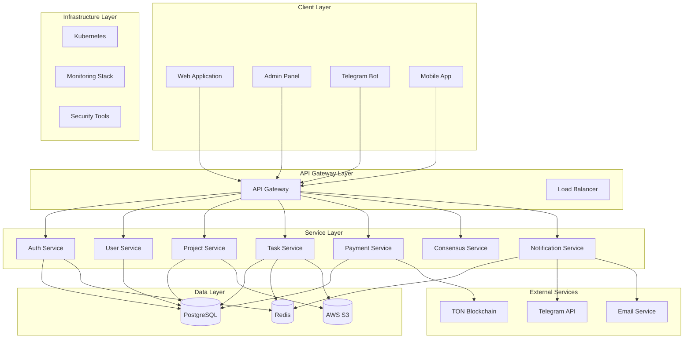
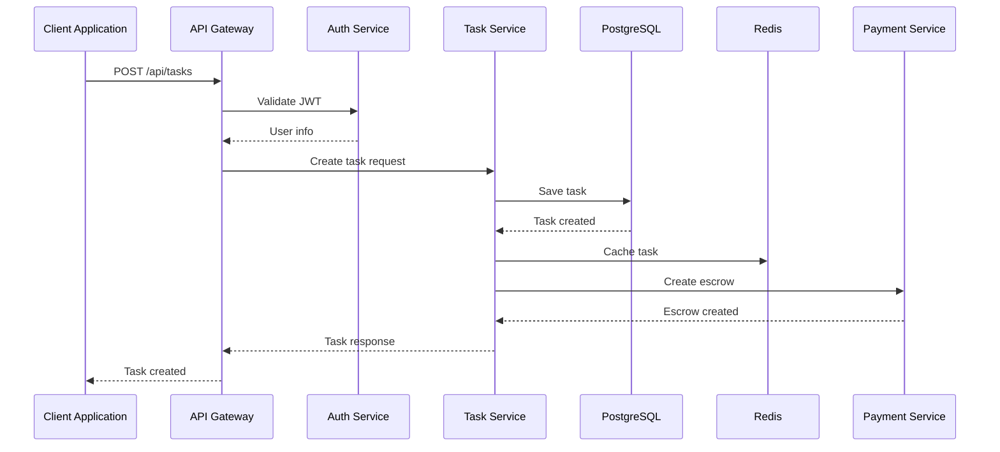
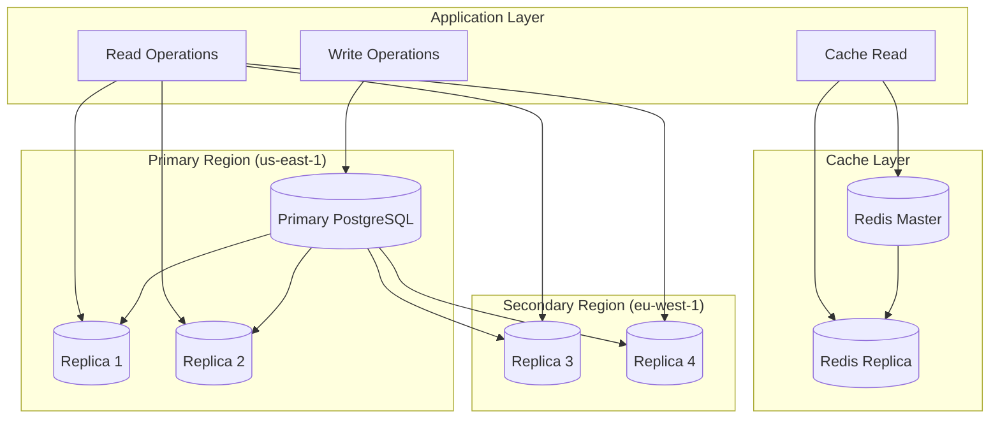
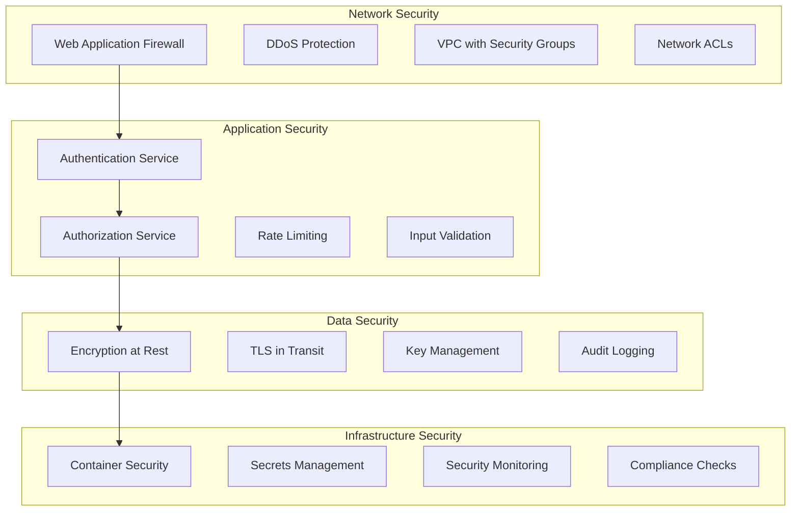
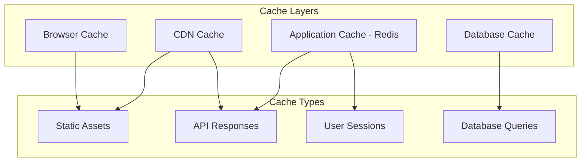
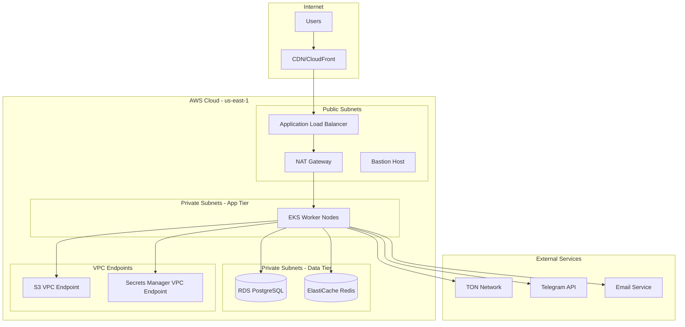

# 🏗️ ARCHITECTURE - System Design & Technical Documentation

Comprehensive architecture documentation for LabelMint platform, covering system design, component architecture, data flow, and technical decisions.

## 📋 Table of Contents

- [🎯 Architecture Overview](#-architecture-overview)
- [🏗️ System Architecture](#️-system-architecture)
- [📊 Component Architecture](#-component-architecture)
- [🔄 Data Flow Architecture](#-data-flow-architecture)
- [💾 Database Architecture](#-database-architecture)
- [🔐 Security Architecture](#-security-architecture)
- [⚡ Performance Architecture](#-performance-architecture)
- [🚀 Scalability Architecture](#-scalability-architecture)
- [🌐 Network Architecture](#-network-architecture)
- [📱 Technology Stack](#-technology-stack)
- [🔧 Design Decisions](#-design-decisions)
- [🗺️ Future Architecture](#-future-architecture)

---

## 🎯 Architecture Overview

### 🎯 Architecture Principles

LabelMint follows these core architectural principles:

- **Microservices Architecture** - Independent, loosely coupled services
- **Event-Driven Design** - Asynchronous communication via events
- **Domain-Driven Design** - Business domains drive system boundaries
- **API-First Approach** - All functionality exposed via APIs
- **Cloud-Native** - Designed for container orchestration
- **Security by Design** - Security built into every layer
- **Observability First** - Comprehensive monitoring and tracing

### 🎯 Architectural Goals

- **High Availability** - 99.9% uptime with redundancy
- **Scalability** - Horizontal scaling to handle growth
- **Performance** - Sub-second response times
- **Security** - End-to-end encryption and audit trails
- **Maintainability** - Clean, modular, well-documented code
- **Flexibility** - Easy to extend and modify

### 📊 System Metrics

- **Response Time**: < 200ms (95th percentile)
- **Throughput**: 10,000+ requests per minute
- **Availability**: 99.9% uptime
- **Data Consistency**: Strong consistency for financial data
- **Security**: Zero-trust architecture with MFA

---

## 🏗️ System Architecture

### 🌐 High-Level Architecture



### 🎯 Core Services

#### 1. API Gateway
- **Responsibilities**: Request routing, authentication, rate limiting, API versioning
- **Technology**: Express.js, Redis, JWT
- **Scalability**: Horizontal scaling with load balancing

#### 2. Authentication Service
- **Responsibilities**: User authentication, authorization, session management
- **Technology**: NextAuth.js, PostgreSQL, Redis
- **Security**: MFA, password hashing, secure session management

#### 3. User Service
- **Responsibilities**: User profiles, preferences, permissions
- **Technology**: Node.js, PostgreSQL, Redis
- **Features**: Profile management, role-based access control

#### 4. Project Service
- **Responsibilities**: Project management, team collaboration, task assignment
- **Technology**: Node.js, PostgreSQL, Redis
- **Features**: Project CRUD, team management, permissions

#### 5. Task Service
- **Responsibilities**: Task creation, assignment, completion, quality control
- **Technology**: Node.js, PostgreSQL, Redis, AWS S3
- **Features**: Task workflow, file handling, quality assurance

#### 6. Payment Service
- **Responsibilities**: Payment processing, wallet management, transaction tracking
- **Technology**: Node.js, PostgreSQL, TON SDK
- **Features**: USDT payments, smart contracts, transaction monitoring

#### 7. Consensus Service
- **Responsibilities**: Dispute resolution, quality consensus, reputation scoring
- **Technology**: Node.js, PostgreSQL, machine learning algorithms
- **Features**: Multi-party consensus, automated dispute resolution

---

## 📊 Component Architecture

### 🏗️ Service Architecture

#### API Gateway Architecture

```typescript
// services/api-gateway/src/gateway.ts
import express from 'express';
import { RateLimiter } from './rate-limiter';
import { AuthMiddleware } from './auth-middleware';
import { LoadBalancer } from './load-balancer';

export class APIGateway {
  private app: express.Application;
  private rateLimiter: RateLimiter;
  private authMiddleware: AuthMiddleware;
  private loadBalancer: LoadBalancer;

  constructor() {
    this.app = express();
    this.rateLimiter = new RateLimiter();
    this.authMiddleware = new AuthMiddleware();
    this.loadBalancer = new LoadBalancer();

    this.setupMiddleware();
    this.setupRoutes();
  }

  private setupMiddleware(): void {
    // Rate limiting
    this.app.use(this.rateLimiter.middleware());

    // Authentication
    this.app.use('/api', this.authMiddleware.middleware());

    // Request logging
    this.app.use(this.requestLogger);

    // CORS
    this.app.use(this.corsMiddleware);
  }

  private setupRoutes(): void {
    // Route to different services based on path
    this.app.use('/api/auth', this.loadBalancer.proxy('auth-service'));
    this.app.use('/api/users', this.loadBalancer.proxy('user-service'));
    this.app.use('/api/projects', this.loadBalancer.proxy('project-service'));
    this.app.use('/api/tasks', this.loadBalancer.proxy('task-service'));
    this.app.use('/api/payments', this.loadBalancer.proxy('payment-service'));
    this.app.use('/api/consensus', this.loadBalancer.proxy('consensus-service'));
  }
}
```

#### Authentication Service Architecture

```typescript
// services/auth/src/auth.service.ts
import bcrypt from 'bcrypt';
import jwt from 'jsonwebtoken';
import { User } from './user.model';
import { Session } from './session.model';

export class AuthService {
  async register(userData: RegisterDto): Promise<AuthResponse> {
    // Validate user data
    await this.validateUserData(userData);

    // Hash password
    const hashedPassword = await bcrypt.hash(userData.password, 12);

    // Create user
    const user = await User.create({
      ...userData,
      password: hashedPassword
    });

    // Generate tokens
    const tokens = this.generateTokens(user);

    // Create session
    await Session.create({
      userId: user.id,
      refreshToken: tokens.refreshToken,
      expiresAt: new Date(Date.now() + 7 * 24 * 60 * 60 * 1000) // 7 days
    });

    return {
      user: this.sanitizeUser(user),
      tokens
    };
  }

  async login(credentials: LoginDto): Promise<AuthResponse> {
    // Find user
    const user = await User.findOne({ email: credentials.email });
    if (!user) {
      throw new UnauthorizedError('Invalid credentials');
    }

    // Verify password
    const isValidPassword = await bcrypt.compare(credentials.password, user.password);
    if (!isValidPassword) {
      throw new UnauthorizedError('Invalid credentials');
    }

    // Generate tokens
    const tokens = this.generateTokens(user);

    // Update session
    await Session.updateOne(
      { userId: user.id },
      {
        refreshToken: tokens.refreshToken,
        expiresAt: new Date(Date.now() + 7 * 24 * 60 * 60 * 1000)
      }
    );

    return {
      user: this.sanitizeUser(user),
      tokens
    };
  }

  private generateTokens(user: User): TokenPair {
    const payload = {
      userId: user.id,
      email: user.email,
      role: user.role
    };

    const accessToken = jwt.sign(payload, process.env.JWT_ACCESS_SECRET!, {
      expiresIn: '15m',
      issuer: 'labelmint',
      audience: 'labelmint-users'
    });

    const refreshToken = jwt.sign(payload, process.env.JWT_REFRESH_SECRET!, {
      expiresIn: '7d',
      issuer: 'labelmint'
    });

    return { accessToken, refreshToken };
  }
}
```

#### Task Service Architecture

```typescript
// services/tasks/src/task.service.ts
import { Task } from './task.model';
import { Project } from '../projects/project.model';
import { PaymentService } from '../payments/payment.service';
import { NotificationService } from '../notifications/notification.service';

export class TaskService {
  async createTask(taskData: CreateTaskDto, creatorId: string): Promise<Task> {
    // Validate project exists and user has permission
    const project = await Project.findById(taskData.projectId);
    if (!project || project.ownerId !== creatorId) {
      throw new ForbiddenError('Insufficient permissions');
    }

    // Create task
    const task = await Task.create({
      ...taskData,
      status: TaskStatus.PENDING,
      createdBy: creatorId,
      createdAt: new Date()
    });

    // Notify potential workers
    await this.notifyPotentialWorkers(task);

    return task;
  }

  async assignTask(taskId: string, workerId: string): Promise<Task> {
    const task = await Task.findById(taskId);
    if (!task) {
      throw new NotFoundError('Task not found');
    }

    if (task.status !== TaskStatus.PENDING) {
      throw new BadRequestError('Task is not available for assignment');
    }

    // Update task
    task.assignedTo = workerId;
    task.status = TaskStatus.ASSIGNED;
    task.assignedAt = new Date();
    await task.save();

    // Create escrow payment
    await this.paymentService.createEscrowPayment(
      task.rewardAmount,
      task.rewardCurrency,
      taskId
    );

    // Notify project owner
    await this.notificationService.notifyTaskAssigned(task);

    return task;
  }

  async completeTask(taskId: string, workerId: string, result: TaskResult): Promise<Task> {
    const task = await Task.findById(taskId);
    if (!task) {
      throw new NotFoundError('Task not found');
    }

    if (task.assignedTo !== workerId) {
      throw new ForbiddenError('Task not assigned to this worker');
    }

    if (task.status !== TaskStatus.ASSIGNED) {
      throw new BadRequestError('Task cannot be completed');
    }

    // Update task with result
    task.result = result;
    task.status = TaskStatus.PENDING_REVIEW;
    task.completedAt = new Date();
    await task.save();

    // Submit for consensus review
    await this.submitForConsensusReview(task);

    return task;
  }
}
```

---

## 🔄 Data Flow Architecture

### 🔄 Request Flow



### 🔄 Event-Driven Architecture

```typescript
// shared/src/events/event-bus.ts
import { EventEmitter } from 'events';

export class EventBus extends EventEmitter {
  static instance: EventBus;

  constructor() {
    super();
    if (EventBus.instance) {
      return EventBus.instance;
    }
    EventBus.instance = this;
  }

  publish(event: DomainEvent): void {
    this.emit(event.type, event);
  }

  subscribe(eventType: string, handler: EventHandler): void {
    this.on(eventType, handler);
  }
}

// Event definitions
export interface TaskCreatedEvent extends DomainEvent {
  type: 'TASK_CREATED';
  data: {
    taskId: string;
    projectId: string;
    creatorId: string;
    rewardAmount: number;
  };
}

export interface TaskAssignedEvent extends DomainEvent {
  type: 'TASK_ASSIGNED';
  data: {
    taskId: string;
    workerId: string;
    assignedAt: Date;
  };
}

export interface TaskCompletedEvent extends DomainEvent {
  type: 'TASK_COMPLETED';
  data: {
    taskId: string;
    workerId: string;
    result: any;
    completedAt: Date;
  };
}

// Event handlers
export class TaskEventHandler {
  constructor(private eventBus: EventBus) {
    this.setupEventHandlers();
  }

  private setupEventHandlers(): void {
    this.eventBus.subscribe('TASK_CREATED', this.handleTaskCreated);
    this.eventBus.subscribe('TASK_ASSIGNED', this.handleTaskAssigned);
    this.eventBus.subscribe('TASK_COMPLETED', this.handleTaskCompleted);
  }

  private async handleTaskCreated(event: TaskCreatedEvent): Promise<void> {
    // Notify potential workers
    await this.notificationService.notifyPotentialWorkers(event.data);

    // Update project metrics
    await this.projectService.updateMetrics(event.data.projectId);
  }

  private async handleTaskAssigned(event: TaskAssignedEvent): Promise<void> {
    // Create escrow payment
    await this.paymentService.createEscrowPayment(event.data.taskId);

    // Notify project owner
    await this.notificationService.notifyTaskAssigned(event.data);
  }

  private async handleTaskCompleted(event: TaskCompletedEvent): Promise<void> {
    // Submit for consensus review
    await this.consensusService.submitForReview(event.data);

    // Update worker reputation
    await this.userService.updateReputation(event.data.workerId);
  }
}
```

---

## 💾 Database Architecture

### 🗄️ Database Schema Design

```sql
-- Core entities
CREATE TABLE users (
    id UUID PRIMARY KEY DEFAULT gen_random_uuid(),
    telegram_id BIGINT UNIQUE,
    username VARCHAR(255) UNIQUE,
    email VARCHAR(255) UNIQUE,
    password_hash VARCHAR(255),
    role VARCHAR(50) DEFAULT 'labeler',
    reputation_score DECIMAL(10,2) DEFAULT 0,
    is_active BOOLEAN DEFAULT true,
    created_at TIMESTAMP WITH TIME ZONE DEFAULT NOW(),
    updated_at TIMESTAMP WITH TIME ZONE DEFAULT NOW()
);

CREATE TABLE projects (
    id UUID PRIMARY KEY DEFAULT gen_random_uuid(),
    name VARCHAR(255) NOT NULL,
    description TEXT,
    owner_id UUID REFERENCES users(id) ON DELETE CASCADE,
    status VARCHAR(50) DEFAULT 'active',
    settings JSONB DEFAULT '{}',
    total_tasks INTEGER DEFAULT 0,
    completed_tasks INTEGER DEFAULT 0,
    created_at TIMESTAMP WITH TIME ZONE DEFAULT NOW(),
    updated_at TIMESTAMP WITH TIME ZONE DEFAULT NOW()
);

CREATE TABLE tasks (
    id UUID PRIMARY KEY DEFAULT gen_random_uuid(),
    project_id UUID REFERENCES projects(id) ON DELETE CASCADE,
    title VARCHAR(255) NOT NULL,
    description TEXT,
    instructions TEXT,
    requirements JSONB DEFAULT '{}',
    reward_amount DECIMAL(20,8) NOT NULL,
    reward_currency VARCHAR(20) DEFAULT 'USDT',
    status VARCHAR(50) DEFAULT 'pending',
    priority INTEGER DEFAULT 1,
    assigned_to UUID REFERENCES users(id),
    created_by UUID REFERENCES users(id),
    result JSONB,
    quality_score DECIMAL(5,2),
    deadline TIMESTAMP WITH TIME ZONE,
    created_at TIMESTAMP WITH TIME ZONE DEFAULT NOW(),
    updated_at TIMESTAMP WITH TIME ZONE DEFAULT NOW()
);

-- Financial entities
CREATE TABLE wallets (
    id UUID PRIMARY KEY DEFAULT gen_random_uuid(),
    user_id UUID REFERENCES users(id) ON DELETE CASCADE,
    address VARCHAR(255) NOT NULL,
    blockchain VARCHAR(50) DEFAULT 'ton',
    is_active BOOLEAN DEFAULT true,
    created_at TIMESTAMP WITH TIME ZONE DEFAULT NOW()
);

CREATE TABLE transactions (
    id UUID PRIMARY KEY DEFAULT gen_random_uuid(),
    wallet_id UUID REFERENCES wallets(id),
    task_id UUID REFERENCES tasks(id),
    amount DECIMAL(20,8) NOT NULL,
    currency VARCHAR(20) DEFAULT 'USDT',
    type VARCHAR(50) NOT NULL, -- 'escrow', 'payment', 'refund'
    status VARCHAR(50) DEFAULT 'pending',
    blockchain_tx_hash VARCHAR(255),
    created_at TIMESTAMP WITH TIME ZONE DEFAULT NOW(),
    completed_at TIMESTAMP WITH TIME ZONE
);

-- Quality and consensus
CREATE TABLE consensus_reviews (
    id UUID PRIMARY KEY DEFAULT gen_random_uuid(),
    task_id UUID REFERENCES tasks(id),
    reviewer_id UUID REFERENCES users(id),
    decision VARCHAR(50) NOT NULL, -- 'approve', 'reject', 'dispute'
    confidence DECIMAL(5,2),
    comments TEXT,
    created_at TIMESTAMP WITH TIME ZONE DEFAULT NOW()
);

CREATE TABLE disputes (
    id UUID PRIMARY KEY DEFAULT gen_random_uuid(),
    task_id UUID REFERENCES tasks(id),
    initiator_id UUID REFERENCES users(id),
    reason TEXT NOT NULL,
    status VARCHAR(50) DEFAULT 'open',
    resolution JSONB,
    resolved_at TIMESTAMP WITH TIME ZONE,
    created_at TIMESTAMP WITH TIME ZONE DEFAULT NOW()
);

-- Indexes for performance
CREATE INDEX idx_users_email ON users(email);
CREATE INDEX idx_users_telegram_id ON users(telegram_id);
CREATE INDEX idx_projects_owner_id ON projects(owner_id);
CREATE INDEX idx_tasks_project_id ON tasks(project_id);
CREATE INDEX idx_tasks_status ON tasks(status);
CREATE INDEX idx_tasks_assigned_to ON tasks(assigned_to);
CREATE INDEX idx_wallets_user_id ON wallets(user_id);
CREATE INDEX idx_transactions_wallet_id ON transactions(wallet_id);
CREATE INDEX idx_transactions_task_id ON transactions(task_id);
CREATE INDEX idx_consensus_reviews_task_id ON consensus_reviews(task_id);
```

### 🔄 Database Replication Strategy



---

## 🔐 Security Architecture

### 🛡️ Security Layers



### 🔐 Authentication & Authorization Flow

```typescript
// shared/src/security/auth.middleware.ts
import jwt from 'jsonwebtoken';
import { Request, Response, NextFunction } from 'express';

export class AuthMiddleware {
  static authenticate(req: Request, res: Response, next: NextFunction): void {
    const token = this.extractToken(req);

    if (!token) {
      return res.status(401).json({ error: 'No token provided' });
    }

    try {
      const decoded = jwt.verify(token, process.env.JWT_ACCESS_SECRET!);
      req.user = decoded;
      next();
    } catch (error) {
      return res.status(401).json({ error: 'Invalid token' });
    }
  }

  static authorize(permissions: string[]) {
    return (req: Request, res: Response, next: NextFunction): void => {
      const user = req.user as any;

      if (!user) {
        return res.status(401).json({ error: 'User not authenticated' });
      }

      const hasPermission = permissions.some(permission =>
        user.permissions?.includes(permission)
      );

      if (!hasPermission) {
        return res.status(403).json({ error: 'Insufficient permissions' });
      }

      next();
    };
  }

  private static extractToken(req: Request): string | null {
    const authHeader = req.headers.authorization;
    if (authHeader && authHeader.startsWith('Bearer ')) {
      return authHeader.substring(7);
    }
    return null;
  }
}
```

---

## ⚡ Performance Architecture

### 🚀 Caching Strategy



### 🚀 Performance Monitoring

```typescript
// shared/src/performance/monitoring.ts
import { performance } from 'perf_hooks';

export class PerformanceMonitor {
  static async measureAsync<T>(
    operation: () => Promise<T>,
    operationName: string
  ): Promise<{ result: T; duration: number }> {
    const startTime = performance.now();

    try {
      const result = await operation();
      const duration = performance.now() - startTime;

      this.recordMetric(operationName, duration);

      return { result, duration };
    } catch (error) {
      const duration = performance.now() - startTime;

      this.recordError(operationName, duration, error);

      throw error;
    }
  }

  private static recordMetric(operationName: string, duration: number): void {
    // Send to monitoring system
    this.sendMetric({
      name: operationName,
      type: 'duration',
      value: duration,
      timestamp: new Date(),
      tags: { service: 'labelmint' }
    });
  }

  private static recordError(operationName: string, duration: number, error: any): void {
    // Send error to monitoring system
    this.sendMetric({
      name: operationName,
      type: 'error',
      value: 1,
      duration,
      error: error.message,
      timestamp: new Date(),
      tags: { service: 'labelmint' }
    });
  }
}
```

---

## 🚀 Scalability Architecture

### 📈 Auto-scaling Configuration

```yaml
# k8s/autoscaling/labelmint-web-hpa.yaml
apiVersion: autoscaling/v2
kind: HorizontalPodAutoscaler
metadata:
  name: labelmint-web-hpa
  namespace: labelmint
spec:
  scaleTargetRef:
    apiVersion: apps/v1
    kind: Deployment
    name: labelmint-web
  minReplicas: 3
  maxReplicas: 50
  metrics:
  - type: Resource
    resource:
      name: cpu
      target:
        type: Utilization
        averageUtilization: 70
  - type: Resource
    resource:
      name: memory
      target:
        type: Utilization
        averageUtilization: 80
  - type: Pods
    pods:
      metric:
        name: http_requests_per_second
      target:
        type: AverageValue
        averageValue: "100"
  behavior:
    scaleUp:
      stabilizationWindowSeconds: 60
      policies:
      - type: Percent
        value: 100
        periodSeconds: 15
    scaleDown:
      stabilizationWindowSeconds: 300
      policies:
      - type: Percent
        value: 10
        periodSeconds: 60
```

### 📈 Load Balancing Strategy

```typescript
// shared/src/load-balancer/load-balancer.ts
export class LoadBalancer {
  private services: Service[] = [];
  private currentIndex = 0;

  addService(service: Service): void {
    this.services.push(service);
  }

  // Round Robin
  getNextServiceRoundRobin(): Service {
    if (this.services.length === 0) {
      throw new Error('No services available');
    }

    const service = this.services[this.currentIndex];
    this.currentIndex = (this.currentIndex + 1) % this.services.length;

    return service;
  }

  // Least Connections
  getNextServiceLeastConnections(): Service {
    if (this.services.length === 0) {
      throw new Error('No services available');
    }

    return this.services.reduce((least, current) =>
      current.activeConnections < least.activeConnections ? current : least
    );
  }

  // Weighted Round Robin
  getNextServiceWeighted(): Service {
    if (this.services.length === 0) {
      throw new Error('No services available');
    }

    const totalWeight = this.services.reduce((sum, service) => sum + service.weight, 0);
    let random = Math.random() * totalWeight;

    for (const service of this.services) {
      random -= service.weight;
      if (random <= 0) {
        return service;
      }
    }

    return this.services[0];
  }
}
```

---

## 🌐 Network Architecture

### 🌐 Network Topology



### 🔥 Network Security

```typescript
// shared/src/network/security.middleware.ts
import rateLimit from 'express-rate-limit';
import helmet from 'helmet';
import cors from 'cors';

export class SecurityMiddleware {
  static securityHeaders = helmet({
    contentSecurityPolicy: {
      directives: {
        defaultSrc: ["'self'"],
        scriptSrc: ["'self'", "'unsafe-inline'"],
        styleSrc: ["'self'", "'unsafe-inline'", "https://fonts.googleapis.com"],
        imgSrc: ["'self'", "data:", "https:"],
        connectSrc: ["'self'", "https://api.telegram.org"]
      }
    },
    hsts: {
      maxAge: 31536000,
      includeSubDomains: true,
      preload: true
    }
  });

  static corsPolicy = cors({
    origin: process.env.ALLOWED_ORIGINS?.split(',') || ['http://localhost:3000'],
    credentials: true,
    optionsSuccessStatus: 200
  });

  static rateLimiter = rateLimit({
    windowMs: 15 * 60 * 1000, // 15 minutes
    max: 100, // limit each IP to 100 requests per windowMs
    message: 'Too many requests from this IP',
    standardHeaders: true,
    legacyHeaders: false,
  });

  static strictRateLimiter = rateLimit({
    windowMs: 15 * 60 * 1000,
    max: 5, // limit each IP to 5 requests per windowMs
    skipSuccessfulRequests: true,
  });
}
```

---

## 📱 Technology Stack

### 🛠️ Frontend Technologies

| Component | Technology | Version | Purpose |
|-----------|------------|---------|---------|
| **Framework** | Next.js | 15.0+ | React framework with SSR/SSG |
| **Language** | TypeScript | 5.0+ | Type-safe JavaScript |
| **UI Library** | Tailwind CSS | 3.4+ | Utility-first CSS framework |
| **State Management** | Zustand | 4.4+ | Lightweight state management |
| **Forms** | React Hook Form | 7.45+ | Form validation and management |
| **HTTP Client** | Axios | 1.5+ | HTTP request library |
| **Testing** | Jest + Playwright | Latest | Unit and E2E testing |

### 🛠️ Backend Technologies

| Component | Technology | Version | Purpose |
|-----------|------------|---------|---------|
| **Runtime** | Node.js | 18.0+ | JavaScript runtime |
| **Framework** | Express.js | 4.18+ | Web application framework |
| **Language** | TypeScript | 5.0+ | Type-safe JavaScript |
| **Database** | PostgreSQL | 15.0+ | Primary database |
| **Cache** | Redis | 7.0+ | In-memory cache and session store |
| **ORM** | Prisma | 5.0+ | Database ORM and query builder |
| **Authentication** | NextAuth.js | 4.24+ | Authentication library |
| **Validation** | Zod | 3.22+ | Schema validation |

### 🛠️ Infrastructure Technologies

| Component | Technology | Version | Purpose |
|-----------|------------|---------|---------|
| **Containerization** | Docker | 24.0+ | Application containerization |
| **Orchestration** | Kubernetes | 1.28+ | Container orchestration |
| **Cloud Provider** | AWS | - | Cloud infrastructure |
| **CI/CD** | GitHub Actions | - | Continuous integration and deployment |
| **Monitoring** | Prometheus + Grafana | Latest | Metrics and visualization |
| **Logging** | Loki + Grafana | Latest | Log aggregation and analysis |
| **Tracing** | Jaeger | Latest | Distributed tracing |
| **Secrets** | AWS Secrets Manager | - | Secrets management |

### 🛠️ Blockchain Technologies

| Component | Technology | Version | Purpose |
|-----------|------------|---------|---------|
| **Blockchain** | TON | - | Payment processing |
| **Smart Contracts** | Solidity (TON) | - | Escrow and payment logic |
| **Wallet SDK** | TON SDK | Latest | Wallet integration |
| **Payment Token** | USDT | - | Stablecoin payments |

---

## 🔧 Design Decisions

### 🎯 Architectural Decisions

#### 1. Microservices Architecture
**Decision**: Adopt microservices architecture over monolithic approach
**Reasoning**:
- Independent scaling of services
- Technology diversity (different services can use different technologies)
- Fault isolation (failure in one service doesn't affect others)
- Team autonomy (different teams can work on different services)

**Trade-offs**:
- Increased complexity in service communication
- Network latency overhead
- Deployment complexity
- Data consistency challenges

#### 2. Event-Driven Communication
**Decision**: Use event-driven architecture for service communication
**Reasoning**:
- Loose coupling between services
- Asynchronous processing improves performance
- Better scalability and resilience
- Easier to add new consumers

**Trade-offs**:
- Eventual consistency challenges
- Debugging complexity
- Event schema versioning
- Duplicate processing concerns

#### 3. Database per Service
**Decision**: Each microservice has its own database
**Reasoning**:
- Service autonomy and independence
- Technology diversity (different services can use different databases)
- Data isolation and security
- Independent scaling

**Trade-offs**:
- Data duplication across services
- Complex data synchronization
- Cross-service queries complexity
- Transaction management challenges

#### 4. API Gateway Pattern
**Decision**: Use API Gateway as single entry point
**Reasoning**:
- Centralized authentication and authorization
- Rate limiting and security policies
- Request routing and load balancing
- API versioning and deprecation

**Trade-offs**:
- Single point of failure
- Performance bottleneck
- Increased complexity
- Vendor lock-in

### 🎯 Technology Decisions

#### 1. Next.js + TypeScript
**Decision**: Use Next.js with TypeScript for frontend
**Reasoning**:
- Server-side rendering for SEO and performance
- Type safety for better development experience
- Rich ecosystem and community support
- Built-in optimization features

#### 2. PostgreSQL + Redis
**Decision**: Use PostgreSQL as primary database with Redis as cache
**Reasoning**:
- PostgreSQL provides strong consistency and ACID compliance
- Rich feature set (JSONB, full-text search, etc.)
- Redis provides fast in-memory caching
- Mature technology with good tooling

#### 3. Kubernetes + Docker
**Decision**: Use Kubernetes for container orchestration
**Reasoning**:
- Cloud-native and portable
- Auto-scaling and self-healing
- Rich ecosystem and community support
- Declarative configuration

---

## 🗺️ Future Architecture

### 🚀 Roadmap

#### Phase 1: Current State (2024)
- ✅ Microservices architecture
- ✅ Event-driven communication
- ✅ Database per service
- ✅ API Gateway pattern
- ✅ Kubernetes deployment
- ✅ Monitoring and observability

#### Phase 2: Enhanced Scalability (2025)
- 🔄 Service mesh (Istio)
- 🔄 Advanced caching strategies
- 🔄 Multi-region deployment
- 🔄 Advanced security features
- 🔄 Performance optimizations

#### Phase 3: Advanced Features (2026)
- 📋 AI/ML integration for task matching
- 📋 Advanced consensus algorithms
- 📋 Mobile applications
- 📋 Enterprise features
- 📋 Advanced analytics

### 🚀 Future Enhancements

#### 1. Service Mesh Implementation
```yaml
# Istio service mesh configuration
apiVersion: networking.istio.io/v1alpha3
kind: VirtualService
metadata:
  name: labelmint-routes
spec:
  hosts:
  - labelmint.com
  gateways:
  - labelmint-gateway
  http:
  - match:
    - uri:
        prefix: /api/tasks
    route:
    - destination:
        host: task-service
        port:
          number: 3000
    fault:
      delay:
        percentage:
          value: 0.1
        fixedDelay: 5s
    retries:
      attempts: 3
      perTryTimeout: 2s
```

#### 2. Advanced Caching
```typescript
// Multi-layer caching strategy
export class AdvancedCacheService {
  private l1Cache = new Map(); // Memory cache
  private l2Cache = new RedisClient(); // Redis cache
  private l3Cache = new CloudFlareKV(); // Edge cache

  async get(key: string): Promise<any> {
    // L1 Cache (Memory)
    if (this.l1Cache.has(key)) {
      return this.l1Cache.get(key);
    }

    // L2 Cache (Redis)
    const l2Value = await this.l2Cache.get(key);
    if (l2Value) {
      this.l1Cache.set(key, l2Value);
      return l2Value;
    }

    // L3 Cache (Edge)
    const l3Value = await this.l3Cache.get(key);
    if (l3Value) {
      this.l1Cache.set(key, l3Value);
      this.l2Cache.set(key, l3Value);
      return l3Value;
    }

    return null;
  }
}
```

#### 3. AI-Powered Task Matching
```typescript
// AI service for task matching
export class TaskMatchingService {
  async findBestMatchers(task: Task): Promise<User[]> {
    const features = await this.extractFeatures(task);
    const candidates = await this.findCandidates(task);

    const scores = await Promise.all(
      candidates.map(async candidate => ({
        user: candidate,
        score: await this.calculateMatchScore(features, candidate)
      }))
    );

    return scores
      .sort((a, b) => b.score - a.score)
      .slice(0, 10)
      .map(item => item.user);
  }

  private async calculateMatchScore(taskFeatures: TaskFeatures, user: User): Promise<number> {
    // Machine learning model for matching score
    const model = await this.loadModel();
    const userFeatures = await this.extractUserFeatures(user);

    return model.predict({ task: taskFeatures, user: userFeatures });
  }
}
```

---

## 📞 Getting Help

For architecture questions:

- **🏗️ Architecture Team**: architecture@labelmint.com
- **💬 Architecture Discussions**: #architecture Slack channel
- **📖 Documentation**: [docs/architecture/](./docs/architecture/)
- **🔧 Infrastructure Issues**: infra@labelmint.com
- **🚀 Performance Questions**: performance@labelmint.com

---

<div align="center">

**🏗️ Building the Future of Data Labeling**

Made with ❤️ by the LabelMint Architecture Team

Last updated: October 2024

</div>